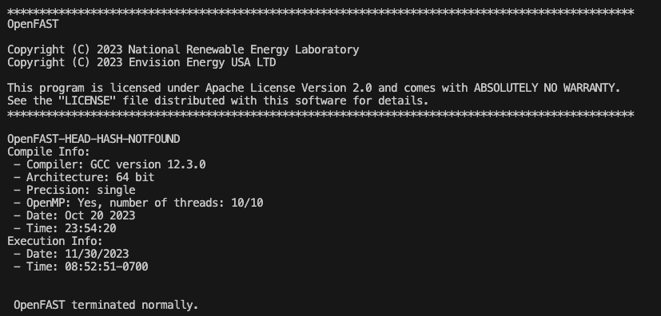

# fast_projects
A project repository with examples that use OpenFAST and FAST tools

# Installation steps:

1. Clone the repository:

     `git clone https://github.com/nRiccobo/fast_projects.git`

2. Create an conda environment [Replace <my-env> with a name]:

    `conda create -n <my-env> python=3.8 -y`

3. Activate the environment:

    `conda activate <my-env>`

4. Install required packages:

    `cd fast_projects`

    `pip install -r requirements.txt`

5. Install OpenFAST [main release or pre-release (dev)]: (Note: skip this step if you already have OpenFAST installed)

    `conda install -c conda-forge openfast`

    -or-

    `conda install -c conda-forge/label/dev openfast`

6. Final setup step of repository:

    `pip install -e .`

# Check OpenFAST installation

    `which openfast`
    `openfast -v`

